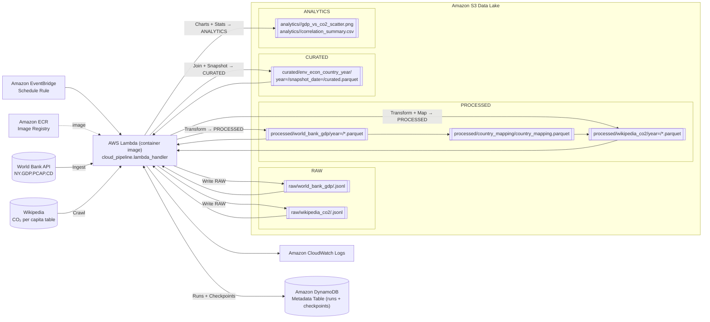

# Architectural Diagram

Notes:
- The Lambda function orchestrates the full run: API ingestion, crawler, transformations, curated join, and analytics generation.
- S3 organizes storage layers as RAW → PROCESSED → CURATED → ANALYTICS with year and snapshot_date partitions where applicable.
- DynamoDB persists run metadata and checkpoints to enable incremental ingestion and idempotent behavior.
- EventBridge schedules the pipeline (daily by default), ECR hosts the container image, and CloudWatch captures logs.

# Detailed Pipeline Explanation

## Ingestion Flow (API and Crawler)

- World Bank API (GDP per capita)
  - Module: `ingestion_api/world_bank_ingestion.py` (function `ingest_world_bank_gdp_raw`).
  - Pagination: uses World Bank v2 API with `per_page=1000`, iterating until `pages` is exhausted.
  - Incremental filter: loads checkpoint `last_year_loaded_world_bank`; keeps records with `year > checkpoint`, and respects optional `min_year`/`max_year` bounds.
  - RAW record enrichment per line (JSONL): `ingestion_run_id`, `ingestion_ts` (UTC ISO), `data_source="world_bank_api"`, `raw_payload` (normalized JSON), `record_hash` (SHA1 of payload), `raw_file_path`.
  - Output: single JSONL under `raw/world_bank_gdp/world_bank_gdp_raw_<timestamp>.jsonl` via `StorageAdapter` (S3 in cloud, local FS in dev).
  - Metadata: starts/ends a run in `MetadataAdapter`; updates checkpoint to max ingested year; stores `rows_processed`.

- Wikipedia crawler (CO2 per capita)
  - Module: `crawler/wikipedia_co2_crawler.py` (function `crawl_wikipedia_co2_raw`).
  - Fetch: downloads page HTML with a custom User‑Agent.
  - Table detection: picks the main `wikitable` by caption/keywords ("emissions", "per capita", "CO2"); falls back to first `wikitable` if needed.
  - Parsing: extracts headers and rows; builds `raw_table_json={headers, rows}` and keeps `table_html` for traceability.
  - RAW record: one JSONL line with `ingestion_run_id`, `ingestion_ts`, `data_source="wikipedia_co2"`, `page_url`, `table_html`, `raw_table_json`, `record_hash`, `raw_file_path`.
  - Output: `raw/wikipedia_co2/wikipedia_co2_raw_<timestamp>.jsonl` via `StorageAdapter`.
  - Metadata: starts/ends a run; `rows_processed` equals number of parsed table rows.

## Storage Layers (raw → processed → curated)

- RAW (append‑only, JSONL)
  - World Bank: one file per run, multiple lines, each line is one API record with audit fields and `record_hash`.
  - Wikipedia: one file per run, one line containing the whole page snapshot (table) with audit fields and `record_hash`.

- PROCESSED (typed Parquet, partitioned by year)
  - World Bank GDP per capita
    - Transform: select/rename fields, numeric coercions, type casts.
    - Columns: `country_code`, `country_name`, `year`, `gdp_per_capita_usd`, `indicator_id`, `indicator_name`, `ingestion_run_id`, `ingestion_ts`, `data_source`.
    - Output: `processed/world_bank_gdp/year=<year>/processed_worldbank_gdp_per_capita.parquet`.
  - Wikipedia CO2 per capita
    - Transform: normalize country names, extract emissions for 2000 and 2023, pivot to long format.
    - Columns: `country_name`, `country_name_normalized`, `country_code` (filled later via mapping), `year` (2000/2023), `co2_tons_per_capita`, `notes`, `ingestion_run_id`, `ingestion_ts`, `data_source`.
    - Output: `processed/wikipedia_co2/year=<year>/processed_wikipedia_co2_per_capita.parquet`.
  - Country mapping
    - Derived from World Bank PROCESSED; computes `country_name_normalized` and merges manual overrides from `src/transformations/country_mapping_overrides.csv` when present.
    - Output: `processed/country_mapping/country_mapping.parquet`.

- CURATED (join of PROCESSED, partitioned by year and snapshot)
  - Join key: `(country_code, year)` between GDP and CO2 datasets.
  - Derived metric: `co2_per_1000usd_gdp = co2_tons_per_capita * 1000 / gdp_per_capita_usd` for valid rows (GDP > 0).
  - Columns: `country_code`, `country_name`, `year`, `gdp_per_capita_usd`, `co2_tons_per_capita`, `co2_per_1000usd_gdp`, `gdp_source_system`, `co2_source_system`, `first_ingestion_run_id`, `last_update_run_id`, `last_update_ts`.
  - Output: `curated/env_econ_country_year/year=<year>/snapshot_date=<YYYYMMDD>/curated_econ_environment_country_year.parquet`.

## Transformation Steps

- World Bank PROCESSED
  - Reads RAW JSONL (local or via `StorageAdapter.read_raw`).
  - Renames fields, enforces types, and writes one Parquet per `year`.

- Country Mapping
  - Scans World Bank PROCESSED Parquets, selects distinct `(country_code, country_name)`, computes `country_name_normalized`, applies optional overrides, writes a single Parquet for reuse.

- Wikipedia PROCESSED
  - Reads RAW snapshot, extracts 2000 and 2023 emissions, normalizes country names, left‑joins mapping to fill `country_code` and canonical `country_name`, writes per‑year Parquets.

- CURATED Join
  - Loads both PROCESSED layers, drops pairs without CO2, computes `co2_per_1000usd_gdp`, writes partitioned by `year` and `snapshot_date`. Records run/snapshot metadata.

## Metadata Tracking Implementation

- Abstraction: `MetadataAdapter` defines `start_run`, `end_run`, `save_checkpoint`, `load_checkpoint`, `list_runs` with two implementations:
  - Local JSON (`LocalMetadataAdapter`) for development.
  - DynamoDB (`DynamoMetadataAdapter`) for cloud.
- Runs:
  - Start: generates `ingestion_run_id`, status `RUNNING`, timestamps.
  - End: updates status (`SUCCESS`/`FAILED`), `rows_processed`, optional `last_checkpoint` and `error_message`.
- Checkpoints:
  - World Bank uses `last_year_loaded_world_bank` (string) to enable incremental by year.
  - CURATED writes `last_checkpoint = snapshot_date=<YYYYMMDD>` for traceability.
- DynamoDB schema (as used by the adapter):
  - Items use `pk`/`sk` with patterns `RUN#<uuid> / META` and `CHECKPOINT#<source> / META`.
  - `end_run` performs an in‑place `UpdateItem` to set final attributes.

## Orchestration / Scheduling Design

- Entrypoint: `cloud_pipeline.lambda_handler` delegates to `run_cloud_pipeline(min_year?, max_year?)` which executes steps 1→7 in order.
- Environment configuration: `PIPELINE_S3_BUCKET`, `PIPELINE_S3_BASE_PREFIX` (optional), `PIPELINE_METADATA_TABLE`.
- Adapters: builds `S3StorageAdapter` and `DynamoMetadataAdapter` from env and wires them through all steps.
- Sequence:
  1) Ingest World Bank RAW → S3
  2) Process World Bank → PROCESSED
  3) Build and persist country mapping
  4) Crawl Wikipedia RAW → S3
  5) Process Wikipedia → PROCESSED (join with mapping)
  6) Build CURATED and persist with snapshot partition
  7) Generate analytics (scatter, correlation) and save under `analytics/<YYYYMMDD>/` when using S3
- Scheduling: Amazon EventBridge triggers the Lambda on a cron/rate expression.

## Cloud Components & Responsibilities

- AWS Lambda (container image)
  - Runs the pipeline code end‑to‑end; handler `cloud_pipeline.lambda_handler`.
- Amazon S3
  - Data lake for RAW/PROCESSED/CURATED/ANALYTICS. Keys are prefixed by an optional `base_prefix` for multi‑tenant isolation.
- Amazon DynamoDB
  - Metadata store for runs and checkpoints. Used by `DynamoMetadataAdapter`.
- Amazon EventBridge
  - Schedules the Lambda (daily by default, configurable via CloudFormation parameter).
- Amazon ECR
  - Hosts the container image referenced by the Lambda.
- AWS CloudFormation
  - Provisions Lambda, IAM Role (S3/DynamoDB access), and the EventBridge Rule; sets environment variables and memory/timeout.
- Amazon CloudWatch Logs
  - Collects Lambda logs for observability and troubleshooting.

# Data Models / Schemas

## Raw Structure

- World Bank API RAW (JSONL; one line per API record)
  - Path: `raw/world_bank_gdp/world_bank_gdp_raw_<timestamp>.jsonl`.
  - Content per line combines the original World Bank record plus audit fields:
    - Original fields (subset): `indicator={id,value}`, `country={id?,value}`, `countryiso3code`, `date`, `value`, etc.
    - Audit fields: `ingestion_run_id` (UUID), `ingestion_ts` (UTC ISO 8601), `data_source="world_bank_api"`.
    - Traceability: `raw_payload` (normalized JSON string of the original record), `record_hash` (SHA1 over the original payload), `raw_file_path` (logical key).
  - Produced by: `src/ingestion_api/world_bank_ingestion.py:ingest_world_bank_gdp_raw`.

- Wikipedia CO2 RAW (JSONL; single line snapshot per run)
  - Path: `raw/wikipedia_co2/wikipedia_co2_raw_<timestamp>.jsonl`.
  - Content fields:
    - `ingestion_run_id`, `ingestion_ts` (UTC ISO), `data_source="wikipedia_co2"`.
    - `page_url` (source URL), `table_html` (HTML of the chosen wikitable).
    - `raw_table_json`: `{headers: [..], rows: [{<header>: <cell_text>, ...}, ...]}`.
    - `record_hash` (SHA1 over `raw_table_json`), `raw_file_path` (logical key).
  - Produced by: `src/crawler/wikipedia_co2_crawler.py:crawl_wikipedia_co2_raw`.

## Processed Structure

- World Bank GDP per capita (Parquet, partitioned by `year`)
  - Path pattern: `processed/world_bank_gdp/year=<year>/processed_worldbank_gdp_per_capita.parquet`.
  - Columns and types:
    - `country_code` string, `country_name` string, `year` int64, `gdp_per_capita_usd` float64,
      `indicator_id` string, `indicator_name` string,
      `ingestion_run_id` string, `ingestion_ts` timestamp (UTC), `data_source` string.
  - Built by: `src/transformations/world_bank_gdp_processed.py:process_world_bank_gdp_raw_file`.

- Wikipedia CO2 per capita (Parquet, partitioned by `year`)
  - Path pattern: `processed/wikipedia_co2/year=<year>/processed_wikipedia_co2_per_capita.parquet`.
  - Columns and types:
    - `country_name` string, `country_name_normalized` string, `country_code` string (filled via mapping),
      `year` Int64 (2000 or 2023), `co2_tons_per_capita` float64,
      `notes` string, `ingestion_run_id` string, `ingestion_ts` timestamp (UTC), `data_source` string.
  - Built by: `src/transformations/wikipedia_co2_processed.py:process_wikipedia_co2_raw_file`.

- Country mapping (single Parquet)
  - Path: `processed/country_mapping/country_mapping.parquet`.
  - Columns and types:
    - `country_name_normalized` string (primary key for mapping), `country_code` string, `country_name` string,
      `source_precedence` string ("world_bank" or "override").
  - Built by: `src/transformations/country_mapping.py:build_country_mapping_from_world_bank_parquet` with `_apply_overrides`.

## Curated Final Dataset

- Econ + Environment by country-year (Parquet, partitioned by `year` and `snapshot_date`)
  - Path pattern: `curated/env_econ_country_year/year=<year>/snapshot_date=<YYYYMMDD>/curated_econ_environment_country_year.parquet`.
  - Join key: `(country_code, year)` between World Bank and Wikipedia processed datasets.
  - Columns and types:
    - `country_code` string, `country_name` string, `year` Int64,
      `gdp_per_capita_usd` float64, `co2_tons_per_capita` float64,
      `co2_per_1000usd_gdp` float64 (derived when GDP > 0),
      `gdp_source_system` string, `co2_source_system` string,
      `first_ingestion_run_id` string, `last_update_run_id` string, `last_update_ts` timestamp (UTC).
  - Built by: `src/transformations/curated_econ_environment_country_year.py:build_and_save_curated_econ_environment_country_year`.

## Naming Conventions and Normalization

- Paths and partitions
  - Layered prefixes: `raw/`, `processed/`, `curated/`, `analytics/`.
  - Partition naming: `year=<year>` for processed/curated; `snapshot_date=<YYYYMMDD>` for curated; analytics grouped by `<YYYYMMDD>`.
  - File names reflect semantic content: `processed_worldbank_gdp_per_capita.parquet`, `processed_wikipedia_co2_per_capita.parquet`, `curated_econ_environment_country_year.parquet`, `country_mapping.parquet`.

- Field naming
  - Snake_case for columns; explicit units/scope where helpful (e.g., `gdp_per_capita_usd`, `co2_tons_per_capita`).
  - Source provenance captured as `data_source` in processed layers and as `*_source_system` in curated.

- Country name normalization
  - Function: `normalize_country_name` lowercases, removes accents (Unicode NFKD), strips non‑alphanumeric (keeps spaces), collapses whitespace, and trims.
  - Mapping precedence: manual overrides take priority over base mapping; `source_precedence` indicates the origin.

- Raw traceability and idempotence helpers
  - `raw_payload` (World Bank) and `raw_table_json` (Wikipedia) preserve the original payload used for hashing.
  - `record_hash` is SHA1 over the normalized raw payload to support change detection and potential deduplication.
